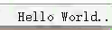

# ida-statusbar

## Example



## Usage

1. Install this package using pip: `pip3 install ida-statusbar`
2. Show a simple text on IDA's status bar:
```
import ida_statusbar
# The text is identified by tag "my-plugin"
ida_statusbar.getStatusBar().showText("my-plugin", "The First Text!")
# Update the text using same tag
ida_statusbar.getStatusBar().showText("my-plugin", "The Next Text!")
# Remove the text
ida_statusbar.getStatusBar().removeText("my-plugin", "The Next Text!")
```
3. You can also show a text using a func (for example to show animation):
```
import ida_statusbar
def textIterFunc(text):
    i = 0
    while True:
        yield text + "." * (i + 1)
        i += 1
        i %= 3
textIter = textIterFunc("Hello World")
ida_statusbar.getStatusBar().showTextByFunc("my-plugin", lambda: next(textIter))
```
4. You can also add your own custom QWidget
```
import ida_statusbar
widget = CustomWidget()
ida_statusbar.getStatusBar().addWidget(widget)
ida_statusbar.getStatusBar().removeWidget(widget)
```